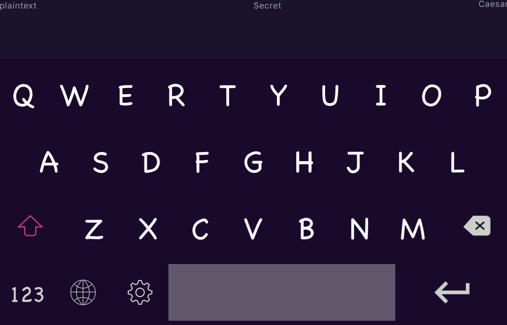

# CryptoKeyboard
A keyboard used to type secret encoded with classic cipher.

## Acknowledgement
Great thanks to open source projects, I learn a lot from you and borrow a lot from you. 
I hope I can give back something valueable to open source community.

The following list is for particular thanks.

### [Kickstart-ios-oss](https://github.com/kickstarter/ios-oss)
### [tasty-imitation-keyboard](https://github.com/archagon/tasty-imitation-keyboard)

## Somethings worthwhile
Concerning the layout of each individual key on a whole keyboard, I use somewhat functional idea 
and follow the idea from [Functional Swift](https://www.objc.io/books/functional-swift/) to create
a small library named <Diagram>, which is as a container for individual key and layout them just
like describe the layout in plaintext.(Like the following code snap)

```
public static let defaultKeyboardDiagram: Diagram<Key> = {
        let a = "QWERTYUIOP" --- 0.5 ||| "ASDFGHJKL" ||| 0.5
        let c = "shift><1.2" ||| 0.1 ||| "ZXCVBNM" ||| 0.1 ||| "backspace><1.2"
        let d = "modechange123" ||| "keyboardchange" ||| "settings" ||| "space><4" ||| "return><2"
        return a --- c --- d
    }()
```




## Feedback
If you find out any issue about this project, please be generous to let me know via a Github issue.
